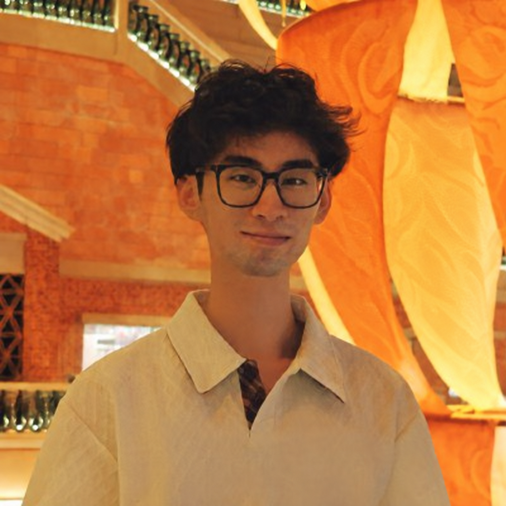

# Hi, I'm Kairun Wen (温凯润) 👋

I'm a first-year Ph.D. student at **[MMLab, The Chinese University of Hong Kong](https://mmlab.ie.cuhk.edu.hk/)**, advised by **[Prof. Hongsheng Li](https://www.ee.cuhk.edu.hk/~hsli/)**.

My long-term goal is to develop **embodied foundation models with multimodal spatial intelligence**. I aim to enable **robot-use agents** to understand and model the dynamic physical world, plan and act through robotic skills and tools, and adapt through interaction and feedback.

[Homepage](https://kairunwen.github.io/) · [Google Scholar](https://scholar.google.com/citations?user=RzRhziMAAAAJ) · [Hugging Face](https://huggingface.co/kairunwen) · [X](https://x.com/KairunWen) · [Email](mailto:wenkairun@gmail.com)

 

### Selected Research

- **[Thinking in Dynamics](https://dyn-bench.github.io/)** — Evaluating how multimodal models perceive, track, and reason about dynamics in the physical 4D world.
- **[DynamicVerse](https://github.com/Dynamics-X/DynamicVerse)** — Physically-aware multimodal 4D world modeling.
- **[InstantSplat](https://github.com/NVlabs/InstantSplat)** — Sparse-view, SfM-free 3D Gaussian reconstruction.

### Resources

- **[Awesome Robot-Use Agent](https://github.com/kairunwen/Awesome-Robot-Use-Agent)** — Papers, research articles, tools, benchmarks, and community demos for robot-use agents.

I'm happy to connect with researchers working on **Robot-use Agent · Embodied Foundation Model · Spatial intelligence**.
